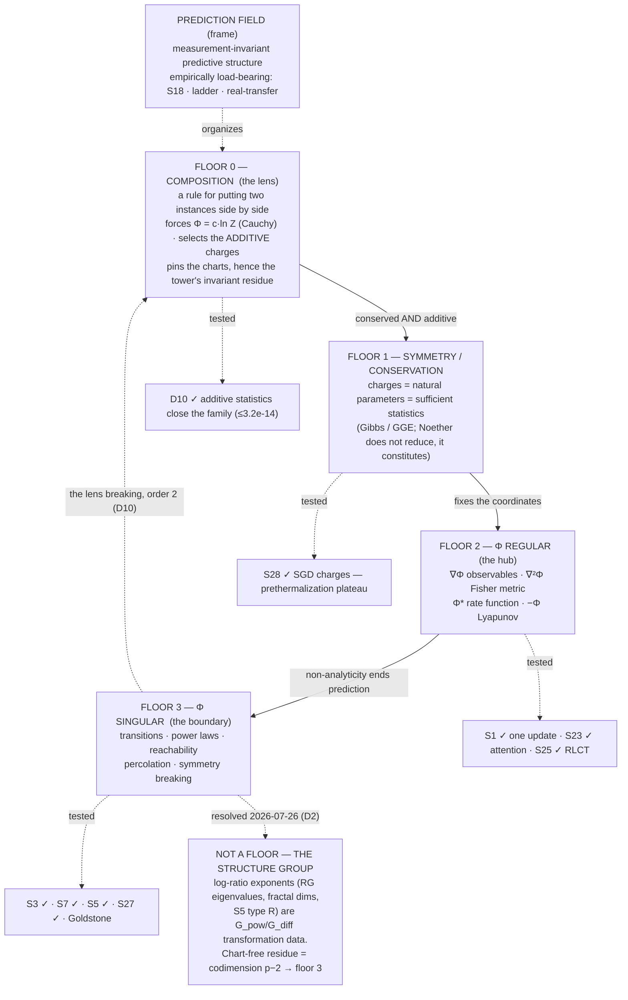

# State of the map — synthesis

*Snapshot: 2026-07-29. Supersedes the 2026-07-19 snapshot, whose through-line
("much of the map is one object seen sideways") has since been corrected three
times — three sectors → two layers → one tower → **one tower standing on a
composition law**. Updated 2026-07-26 with floor 3's partial classification and the
opening of the [discovery register](./questions/UNKNOWN-LAWS.md); updated 2026-07-29
with [floor 0](./derivations/D10-composition-lens.md), which is the first correction
to arrive from *below* the architecture rather than inside it.*

This document makes the whole structure legible in one read: what we're doing,
what has actually been established, what is still a speculative stone, and the
architecture that has emerged. Everything here links to its source; nothing here
is a new claim.

---

## 1. In one paragraph

We are mapping **cross-domain invariants** — laws and structures that recur across
fields — and, above all, telling the real ones from seductive analogies by placing
each on an explicit [ladder of rigor](./METHODOLOGY.md) (L0 metaphor → L4 provable
universality). Three structural results have come out of the work itself: (a) the
object we map is best understood as a **[prediction field](./PREDICTION-FIELD.md)**,
and that frame is now *empirically load-bearing*, not merely self-consistent;
(b) a large core of the catalog collapses onto one scalar, the
**[free-energy hub](./invariants/free-energy-hub.md)** Φ = ln Z, whose derivatives
*are* the recurring objects; and (c) the collapse is **not monism** — the map is a
**tower with three floors**: symmetry chooses Φ's coordinates, Φ's regular part
predicts, Φ's singular part is where prediction ends. The slogan:
**one object, three floors — chosen by symmetry, read by prediction, ended by
breakdown.** *(⟳ 2026-07-29: the tower gained a floor at the **bottom**.
[D10](./derivations/D10-composition-lens.md) found that floor 1 takes the symmetry
group as *given*, and there is no outside to give it; under it sits a **composition
law**, which forces Φ's form, supplies floor 1's missing selection rule, and — since
Φ is a cumulant generating function — must be maintained one order at a time. The
corrected slogan: **built by composition, chosen by symmetry, read by prediction,
ended when composition lapses.**)*

---

## 2. The method, in one picture

- **The ladder.** Every correspondence gets a level: L0 word · L1 structure ·
  L2 same math · L3 same mechanism · L4 provable universality. An entry isn't done
  until it states its level *and* where it breaks.
- **The rhythm.** Two strokes: **expansion** (make leaps — home:
  [`SPECULATIVE.md`](./questions/SPECULATIVE.md)) and **restraint** (test, prune —
  home: [`experiments/`](./experiments/), [`derivations/`](./derivations/)).
  Expansion without restraint is confabulation; restraint without expansion is
  bookkeeping. Leaps that survive a falsifier graduate; leaps that die are logged
  and marked L1 — and, as §7 records, the ones that die have been the more
  productive half.
- **The second axis (added 2026-07-26).** The ladder grades how well a
  correspondence is *established*; it says nothing about whether it is *new*.
  Every stone through S26 takes a law already known in one field and asks how far
  it travels — **recognition**, whose ceiling is the union of the textbooks.
  [`UNKNOWN-LAWS.md`](./questions/UNKNOWN-LAWS.md) opens **discovery**, graded on
  a **novelty ladder** (N0 restatement → N3 new object) that *multiplies* with the
  rigor ladder, and guarded by two rules recognition does not need: a prior-art
  note written before the work, and a pre-registration that marks which
  predictions are analytic identities before the run.

---

## 3. What actually has teeth — the ledger

Every result that survived a restraint pass, with the limit we wrote down for it.

### The frame and its falsifier

| # | Result | How | Verdict | The limit |
|---|--------|-----|---------|-----------|
| **S18** | [Invariance predicts transfer](./experiments/S18-invariance-transfer/) | experiment | **frame's falsifier survived** — train-invariance ranks held-out transfer at ρ=0.985; the best in-distribution feature is the worst-transferring | constructed SCM where invariance = causation by design |
| **§6** | [Ladder level predicts transfer](./experiments/ladder-vs-transfer/) | experiment | **confirmed, then corrected** ([paper 1](./paper/transfer-cliff.md)) — level orders transfer (0.03/0.48/0.92/0.89) and mechanism and theorem transfer equally. The "cliff at L2/L3" *step* reading is **retracted** (L1→L2 = 0.451 ≈ L2→L3 = 0.432); what is real is a **ceiling** — L3/L4 reach complete transfer (measured ceiling 0.920±0.023), L2 saturates at ~0.54 forever | controlled within the CLT family; synthetic |
| **§6** | [The frame on real data](./experiments/real-transfer/) | experiment | **passed** — invariance predicts transfer at ρ=0.983 on the diabetes dataset; Benford transfers across 2ⁿ/3ⁿ/n!/Fibonacci (0.97), fails on controls (0.00) | Leg A has a signal-strength confound; multi-field study still open |
| **S25** | [Channel-independence of the singularities](./experiments/S25-channel-independence/) | experiment | **🔴 tier tested, did not promote** — singularities are *invariant* under generic channels and *covariant* under structured ones: F_c(T)=F_eff(T′)(dT′/dT)² exact to 1e-14 | one pre-registration error on record (parity blind only at odd N) |

### The hub and its facets

| # | Result | How | Verdict | The limit |
|---|--------|-----|---------|-----------|
| **S1** | [Replicator = MW = Bayes = Gibbs](./derivations/S1-universal-update.md) | derivation | **L3, exact** — all are `x_i ∝ x_i·e^{−η g_i}`; free energy = −log-evidence = log-loss = −log-growth | *global* dynamics not shared — game-coupled losses cycle forever (L1) |
| **S23** | [Attention = the universal update](./experiments/S23-attention-bayes/) | derivation + experiment | **exact** — softmax attention = a Bayesian update over memories to 1.4e-17; attention temperature = η = 1/σ² | single-head, single-step, Gaussian memory |
| **S3** | [Fisher curvature spikes at transitions](./experiments/S3-fisher-geometry/) | experiment | **strong L2** — χ→∞ at Ising T_c; inverse-Fisher blows up exactly at the double-descent peak | a Fisher-*magnitude* proxy, not full curvature; grokking untested |
| **S25** | [The RLCT prices the singular field](./experiments/S25-rlct-singularity/) | experiment | **confirmed, all registered predictions** — free-energy slopes recover exact RLCTs (0.508 vs ½ where d/2=1); risk *and* covariate-shift transfer plateau with λ, not d | rank-type singularities; shift ≠ cross-domain transfer |
| — | [Channels stay near one-parameter](./derivations/S25-one-parameterness.md) | derivation | **proved**, with the exact obstruction identified and numerically verified | Boltzmann families |

### The architecture (this is what changed)

| # | Result | How | Verdict | The limit |
|---|--------|-----|---------|-----------|
| **S27** | [Control splits — and the "irreducible" half reduces](./derivations/S27-control-split.md) | derivation | **falsifier fired, conjecture upgraded** — Gramian ≡ ∇²Φ of the noise-driven ensemble; min control energy = Legendre dual of Φ. But binary reachability lands in Φ's *singular* set. **Connectivity facts are Φ-boundary facts** | exact linear-Gaussian; Freidlin–Wentzell beyond |
| — | [The symmetry sector](./derivations/symmetry-sector.md) | derivation | **monism fails, "second sector" also fails** — SSB reduces to Φ-singular; Noether does *not* reduce but **constitutes**: conserved charges are the natural parameters of long-time ensembles. Architecture: **one tower, three floors** | equilibrium/long-time only; GGE exhaustiveness heuristic away from integrability; **§2's rule corrected by D10** — conservation is necessary, additivity is the other half |
| **D10** | [Floor 0 is a composition law](./derivations/D10-composition-lens.md) | derivation + experiment | **the tower gained a floor at the bottom, and floors 2–3 are its failure orders.** The natural-parameter slot takes **additive** statistics, not merely conserved ones — the family closes for exactly the additive rows (**≤3.2e-14**) and no others (**≥8.8e-4**), with linearity, monotonicity and convexity each refuted by a row, in a leg containing **no dynamics and no group**. Since Φ is a CGF, additivity is one condition per order: order 0 fails ⇒ Φ\* is the concave hull, not s (defect ~N^**1.0252**, c<0 on **68.6%** of e) ⇒ **floor 2's Legendre face breaks**; order 2 fails ⇒ δ₂ = **0.29364** vs 1−2^{−½} at T_c and **0.50010** below it ⇒ **criticality and SSB, same order, two mechanisms**; no order ⇒ heavy tails, retrodicting **P-B**. Also answers [`FLOORS.md`](./invariants/FLOORS.md) §4: the residue is the invariant content of the largest group composition fails to pin | **N1 — C1 is Cauchy, C2 is Koopman–Pitman–Darmois**; "long-range ⇒ non-additive" **killed by its own control** (mean-field q=2 gives exactly zero) leaving the weaker "first-order realizes it"; two registered items failed (leg C's growth exponent, leg D3's discriminator); the d ≥ 2 surface-scaling control is **not run**; the mereology half is argued, measured nowhere |
| **S28** | [SGD's stationary law is charge-coordinatized](./experiments/S28-sgd-charges/) | experiment | **falsifier did not fire; sharper than the claim** — weight-decay breaking obeys dQ/dt = −4λQ to 1e-5; stationary norm from the charge alone to 3e-4; a **prethermalization plateau** with a ~1.8M-step window | minimal scale-symmetric model; claim is now timescale-indexed |
| **S26** | [Is degeneracy an attractor?](./experiments/S26-llc-trajectory/) | experiment | **attractor claim falsified** — endpoint deeply singular (λ̂=1.38 vs d/2=8) but λ̂ drifts *up* post-convergence and noiseless GD lands identically. Survivor: **the low-loss set is generically singular** — degeneracy is where you end up, not what pulls you | λ̂ meaningless at non-critical points; grokking is the escalation |
| **P-A** | [The spectral gap is a null direction](./experiments/PA-spectral-gap/) | experiment | **the sort's first prediction, cashed** — #19's floor-3 assignment confirmed with Φ fixed in advance (Λ''·gap = 2⟨f,v₂⟩² = 2.0000), but *directional*: orthogonal to the slow mode Λ'' is unchanged while the gap falls 31×. "One number" demoted to one mechanism with constants spanning 1.54× | 3 of #19's 4 readouts are one number by construction; reversible chains only; one registered threshold failed as written |
| **D6** | [Support singularities: D1 was a special case](./experiments/D6-support-singularities/) | experiment | **floor 3's classifier is the ratio q1/q2 of Φ's two leading exponents.** A_c ~ D^{1−q1/q2}: **q1 = 2 is what smoothness forces** (D1's (p−2)/p), **support loss is q1 = 1**, a hard wall is q2 → ∞ (0.9979 vs 1). Support loss is not p = ∞ — that would be a q2 value; M/M/1 has an *empty* q2 slot and no crossover at all (kurtosis 6.0000 over four decades). Three at-risk legs pass and **none are physics** | P1/P2 are identities and **P2 was mis-registered as at-risk**; the ratio claim is untested on real models; remainder narrows to **essential singularities only** |
| **D2** | [The scheme layer is the tower's gauge group](./derivations/D2-gauge-of-the-tower.md) | derivation + experiment | **the P0 is answered — there is no fourth floor.** The floors are defined up to G_diff, cross-domain comparison has only G_pow, and the scheme layer is the difference: RG eigenvalues are conjugation-invariant (5.3e-15) and G_pow-covariant as y → a·y (≤2.4e-12), exactly like D1's chart order. **The chart-free residue is the codimension p − 2** (β/k = 0.5000, 0.2503 vs 1/(p−2)). Also explains why floor 2 collapses and floor 3 stratifies | most of the experiment is a theorem check; both at-risk legs are physics; the **common-a** commitment is load-bearing; the G_diff half is Wegner's nonlinear scaling fields in other words |
| **D1** | [The chart law — two integers classify floor 3](./experiments/D1-chart-invariance/) | experiment | **chart claim confirmed, formula deflated by its own prior-art note** — a floor-3 degeneracy carries a **chart order** *k* (gauge) and a **degeneracy order** *p* (invariant), λ_c ~ D^{(p−2)/p}. *k* removed by inference (two fields, λ-chart 0.33333 vs 0.33333 where bare exponents differ 2×) and by manipulation (ε′=ε^a moves the bare exponent by exactly a, the λ-chart exponent not at all). **S5's and S7's "domain-specific exponents" are largely a chart artifact** | 1-D gradient systems, additive noise; **support-type singularities have no *p*** and are excluded; both at-risk legs are physics; legs A/B are declared identities, not evidence |
| **P-D** | [Allometry is a log-ratio, not a Φ-derivative](./experiments/PD-allometry-reduction/) | experiment | **the sort's only *negative*, cashed** — θ = **min(1, ln n/−ln(β²γ))** to 7.1e-11, n cancelling to 4.0e-15. Blind to six decades of six magnitudes (1.1e-8), responsive to structural counts. Optimization is a **selector, not a source**: six cost functionals → six β, θ recovered from (β,γ) alone. **The variational route gives θ = 1, not 3/4.** ∇²log Z **rank 1 for every λ** (control swings 151%). Second route: θ = d/(d+1). **Reframed by D2** (leg F): θ is invariant under scheme coarse-graining to 2.6e-15 and mass is extensive, so it is the structure group's **invariant residue**, not a floor-4 exhibit | models of allometry, not organisms; P8 measures rank, doesn't prove no Φ exists; two registered items failed (MST construction, mean-field control); leg F is post-hoc |
| — | [The catalog, sorted by floor](./invariants/FLOORS.md) | audit against the derivation | **sorted, and it deletes** — seven facet-faces are one convex function differentiated seven ways (▸facet); effective independent count 23 → ~16. Asymmetry found: **floor 2 collapses, floor 3 stratifies**. **Two entries refused the tower outright** (plus the type-R half of a third), all with the same signature: a log-ratio exponent | assignments for `seed` entries are *predictions*, not findings — #6, #9, #10, #19, #21, #22 and #4's reduction now rest on evidence; the rest do not |

### Where "one law" claims keep landing

| # | Result | How | Verdict | The limit |
|---|--------|-----|---------|-----------|
| **S7** | [Critical slowing down](./experiments/S7-critical-slowing/) | experiment | **mechanism confirmed, exponent refuted** — τ·λ_min = 0.94±0.13 across saddle-node/Ising/GD-at-the-MP-edge, no tuning; divergence exponents domain-specific (−½/−1/−2) | mean-field models; near-critical quartic bias documented |
| **S5** | [Three noise thresholds](./experiments/S5-noise-thresholds/) | experiment | **falsifier fires — exponents span 1.00→3.17** — and the variation is *within* domains, not across them. Replacement: α is a **degeneracy order** — 2 for a smooth metric merge (forced by the Fisher expansion), 1 for support loss, ln n₀/ln(t+1) for a decoder's RG fixed point. α = order of vanishing of χ²_sym to 0.0015 | concatenation ≠ fault tolerance as such (LDPC gives O(1) overhead); binary-input memoryless channels; orders 1 and 2 only |
| — | [Is the method itself the universal update?](./derivations/essay3-method-as-update.md) | derivation | **retired as stated** — the method is a *replicator–mutator*: expansion provably lies outside (★), since multiplicative updates preserve zeros | attention face L1–L2, revival condition is a designed multi-epoch test |

---

## 4. The through-line: one object, four floors

The 2026-07-19 synthesis said the map was "one object seen sideways." Three
derivations have corrected that. The reduction *is* real and it went further than
expected — feedback/control, reachability, percolation and symmetry-breaking all
collapsed inward — but the thing they collapsed into is layered, one piece refused
to collapse and turned out to sit *underneath*, and then that piece turned out to
take an input of its own:

```
  composition (the lens)    →  fixes what counts as two systems  (added 2026-07-29)
  symmetry / conservation   →  chooses Φ's coordinates   (which quantities exist)
  Φ, regular part           →  prediction                (moments, Fisher, updates)
  Φ, singular part          →  boundaries                (transitions, power laws,
                                                          reachability, percolation, SSB)
```

**The floor at the bottom, and why it was invisible.**
[D10](./derivations/D10-composition-lens.md) started from a gap rather than a
result: floor 1 says symmetry chooses Φ's coordinates, the derivation takes the
group as *given*, and **there is no outside to give it**. Three of the repo's own
results had already reached past floor 1 for the missing thing without naming it —
[P-D leg F](./experiments/PD-allometry-reduction/) killed G_pow because *mass is
extensive*, [D2 §7](./derivations/D2-gauge-of-the-tower.md) reconciled universality
because *energy is additive*, and symmetry-sector's charges were, without comment,
*exactly the additive ones*.

What sits there is a **composition law** ⊎ — a rule for putting two instances of a
system side by side. It needs no observer, no group and no dynamics; only that the
system can be next to a copy of itself. And it does four things:

- **Forces Φ's form.** Independent parts multiply, so the unique continuous
  *additive* summary is c·ln Z (Cauchy). Every place the map was surprised to
  arrive at a logarithm is arriving at the one function that turns ⊎ into +.
- **Supplies floor 1's missing rule.** The natural-parameter slot takes **additive**
  conserved quantities, not merely conserved ones — measured with no dynamics
  anywhere in the test, which is what makes it a layer underneath rather than a
  restatement of floor 1.
- **Decides which charts are pinned**, and therefore what the tower's invariant
  residue *is* in general — [`FLOORS.md`](./invariants/FLOORS.md) §4's live
  question, now answered.
- **Must be maintained**, one order at a time. Which is the next paragraph.

**Floors 2 and 3 are its failure orders.** Φ is a cumulant generating function, so
"Φ is additive under ⊎" is not one condition but one per order:

```
   order 0 fails            ->  Phi* = concave hull != s   ->  FLOOR 2's Legendre face
   order 2 fails, anomalous ->  Var/N -> infinity          ->  FLOOR 3, criticality
   order 2 fails, mixture   ->  delta_2 = 1/2              ->  FLOOR 3, symmetry breaking
   no order exists          ->  cumulants absent           ->  FLOOR 3, heavy tails
```

Measured, exactly: δ₂ = 0.00240 / **0.29364** / 0.50010 against 0 / 1−2^{−½} / ½,
the middle value anomalous and inherited from a critical exponent. So the tower's
base and its top are **one condition read at different orders** — the lens is prior
to the tower, and the tower's top floor is the lens breaking. That also gives §5's
five arrivals at the singular set of ∇²Φ a second description: they are five
arrivals at a broken composition law, read at order 2.

The direction of explanation runs bottom-up, which is exactly why every attempt to
express Noether *inside* Φ-machinery failed while the converse kept succeeding:
Noether's theorem consumes a bracket, Φ has only a measure. What survives into a
stationary prediction field is what is conserved — Jaynes read in reverse.



**What sorting the catalog against it revealed.** Running every entry through the
tower ([`invariants/FLOORS.md`](./invariants/FLOORS.md)) exposed an asymmetry the
old "one object seen sideways" slogan could not express:

> **Floor 2 collapses. Floor 3 stratifies.**

The regular part of Φ really is one function seen from seven angles — entropy,
duality, the bottleneck, the universal update, replicator dynamics, Pareto
frontiers and statistical geometry are ∇Φ, ∇²Φ, Φ* or −Φ of the *same* convex
function, and the catalog now marks them ▸facet and stops double-counting them.
The singular part does **not** collapse: criticality, power laws, percolation,
SSB, slowing-down and the noise thresholds are *different* singularities —
non-analyticity, divergent moments, null directions, lost supports — and
[S5](./experiments/S5-noise-thresholds/) measured that they carry *different
exponents*. Redundancy deletion is a floor-2 operation; floor 3 needs
classification instead.

**Floor 3's classification, partially delivered — and a correction to how its
exponents were read.** [D1](./experiments/D1-chart-invariance/) found that a
degeneracy-type floor-3 singularity carries **two** numbers, and that only one of
them is a fact about the singularity:

```
   k = chart order       lambda ~ eps^k in whatever coordinate the domain supplies   -> GAUGE
   p = degeneracy order  first non-vanishing anharmonic term of Phi                  -> CLASSIFIES
```

Since ε′ = ε^a describes the same singularity and divides every exponent by a, a
*bare* exponent is a property of the coordinate, not the object. Measured: a fold
in population dynamics and an SIS epidemic — same *p*, chart orders differing 2× —
have bare exponents 0.667 and 0.333 and λ-chart exponents 0.33333 and 0.33333. In
the bare chart the fold (p = 3) and a tricritical point (p = 6) *agree to three
decimals* while the fold and the epidemic, the same degeneracy, differ by a factor
of two. **So the exponent spreads S5 and S7 filed as "domain-specific" are largely
a chart artifact** — which retro-reads S7's τ·λ = 1 as the statement that the
relaxation exponent is −1 in the λ chart in every domain.

**And *p* itself turned out to be a special case.**
[D6](./experiments/D6-support-singularities/) generalized the classifier by
stopping treating *p* as primitive. Writing Φ's two leading terms as
A|y|^{q1} + B|y|^{q2} with A → 0, the crossover locus is **A_c ~ D^{1 − q1/q2}**:

```
   q1 = 2      what SMOOTHNESS forces   ->  D1's p, exponent (p-2)/p
   q1 = 1      a kink or a boundary     ->  support loss (S5's type S)
   q2 -> oo    a hard wall              ->  exponent 1
```

So **floor 3's classifier is the ratio q1/q2** — which is exactly the form
[D2](./derivations/D2-gauge-of-the-tower.md) derived the chart-free residue must
take, arrived at independently and on the class D2's codimension argument could not
reach. Support loss is *not* p = ∞ (that would be a value in the q2 slot); M/M/1
has an **empty** q2 slot and therefore no crossover at all. The remaining
unclassified part of floor 3 is now **essential singularities only** — Φ with no
leading power whatsoever.

**Honest scope.** The tower is derived for equilibrium / long-time (stationary)
prediction fields. Driven, non-stationary systems can carry non-conserved
quantities in their description indefinitely, and the base-floor claim does not
reach them. GGE exhaustiveness is exact for integrable systems and
standard-but-heuristic elsewhere.

---

## 5. The most-arrived-at object in the repo

The single strongest empirical regularity in this project is not any one
invariant. It is that **independent lines of attack keep landing on the singular
set of ∇²Φ** — the same object, reached five times, from five directions, by
people (well, passes) looking for different things:

| Arrival | Route | What it saw there |
|---------|-------|-------------------|
| 1 | [S3](./experiments/S3-fisher-geometry/) | **divergence** — χ→∞ at T_c, inverse-Fisher→∞ at double descent |
| 2 | [S27](./derivations/S27-control-split.md) | **null spaces** — unreachable directions are null Fisher directions / support facts |
| 3 | [symmetry sector](./derivations/symmetry-sector.md) | **flat directions** — Goldstone modes are null directions of ∇²Φ |
| 4 | [S7](./experiments/S7-critical-slowing/), sharpened by [P-A](./experiments/PA-spectral-gap/) | **the slow mode** — τ = 1/λ_min; critical slowing is the Hessian going soft. P-A found *which* Hessian: in a double well the gap falls 3540× while the local curvature **rises** 6×, so S7's law is a **single-basin** law and the general object is the trajectory free energy's Hessian |
| 5 | [S5](./experiments/S5-noise-thresholds/) | **the order of the degeneracy** — the redundancy exponent counts how fast the induced Fisher information vanishes (2 = metric merge, 1 = support loss) |

**⟳ A second description of all five (2026-07-29,
[D10](./derivations/D10-composition-lens.md)).** ∇²Φ is the second cumulant, and the
second cumulant of an additive system is extensive. So every arrival above is an
arrival at **the second cumulant ceasing to be extensive** — a composition law
failing at order 2. Measured: δ₂ = 1 − 2·Var(N)/Var(2N) reads **0.00240** above
T_c, **0.29364** at it (against the anomalous 1 − 2^{−1/2} = 0.29289, inherited
from Var ~ N^1.504) and **0.50010** below. This does not add a sixth arrival; it
says what the place is. And it separates two things "χ diverges" cannot: the
critical value is anomalous, the broken-symmetry value is a mixture, and they are
different numbers at the same order.

[The RLCT result](./experiments/S25-rlct-singularity/) is best read not as a sixth
arrival but as the *quantification* of the same object: λ is the chart of the
region where the metric degenerates, and it — not parameter count — prices
generalization and transfer.

Arrival 5 is the one that changed the picture, because it is the first to
**measure the order** rather than note the singularity. Both of S25's named
singular faces (null Fisher directions; supports) turn up in the same experiment
carrying *different exponents* — which is precisely why S5's "one threshold, one
exponent" premise had to fail.

---

## 6. The map at a glance

- **1 frame:** the prediction field (🟢 core empirically load-bearing; 🔴 metaphysical
  reading tested once and explicitly *not* promoted).
- **1 hub:** Φ = ln Z (L3; L4 via Lee–Yang).
- **4 floors, numbered 0–3:** composition · symmetry-constituted · Φ-regular ·
  Φ-singular — and **no fourth *above***. Floor 0 was added 2026-07-29 by
  [D10](./derivations/D10-composition-lens.md) at the *bottom*, which is a different
  question from the one D2 answered: D2 asked whether the refusers were a new layer
  of facts on top (no, they are the structure group), D10 asked what floor 1
  consumes (a composition law). Floors 2 and 3 are floor 0's failure orders.
  The proposed scheme layer resolved (2026-07-26,
  [D2](./derivations/D2-gauge-of-the-tower.md)) into the tower's **structure
  group**: the floors are defined up to G_diff, cross-domain comparison has only
  G_pow, and the log-ratio "signature" was the difference between them. Its
  chart-free residue is the **log-slope vector modulo the diagonal ℝ⁺**
  (2026-07-27, [D7](./derivations/D7-the-residue.md)) — the slopes of observables
  against *other* observables, carrying **n − 1** invariants. For a smooth floor-3
  germ that is the codimension p − 2; the integrality is Taylor orders' and not the
  residue's. With **m controls** rather than one it is the column space of the slope
  matrix, a point of **Gr(r, n)** with **r(n − r)** invariants whose rank counts the
  relevant directions (2026-07-28,
  [D8](./experiments/D8-grassmannian-residue/)) — D7 being the r = 1 slice.
- **23 catalog entries, [now sorted](./invariants/FLOORS.md)**: 1 hub, 1 on floor 1,
  6 floor-2 facets (▸ deleted as independent), 2 floor-2 non-facets, 6 distinct
  floor-3 members, 5 splitting across floors, **2 refusing the tower**. Effective
  independent count **~16**. There is no longer an unexamined "periphery" — every
  entry now carries a floor and a reason.
- **28 speculative stones** (S1–S28; the two number collisions were resolved 2026-07-27 — Cluster K's stones are S27/S28 and the S25(J)/S25(K) suffixes are retired).
  **Worked:** S1, S3, S5, S7, S9 (sharpened), S11 (strong form falsified), S18,
  S23, S25, S27, S26, S28. **Unworked:** S2, S4, S6, S8, S10, S12–S17,
  S19–S22, S24.
- **9 discovery stones** (D1–D10, D7 reused once — see the register's numbering
  note) in the new [`UNKNOWN-LAWS.md`](./questions/UNKNOWN-LAWS.md) register.
  **Worked:** D1 (chart claim confirmed; formula deflated to N0–N1 by its
  own prior-art note), **D2** (the P0 answered — no fourth floor), **D6** (D1's
  *p* generalized; floor 3's classifier is a ratio), **D7** (the P0's successor —
  the residue's general form, and a count), **D8** (the multi-parameter form —
  a Grassmannian point whose rank counts the relevant directions), and **D10**
  (floor 0 — a composition law under floor 1, and a second general account of the
  residue). **Unworked:** D4, D5. **D9 was run 2026-07-28 and is inconclusive** —
  it rebuilt D3's four rungs around an *unpinned* chart, and the residue legs
  passed cleanly, but the harness turned out to have almost no dynamic range in
  transfer (0.938–0.988 across the rungs that matter), because crossing p = 4 →
  p = 6 barely changes the fluctuation law. **D3's open half stays open**, with the
  concrete fix registered. By-product: **the degeneracy order is nearly invisible
  in the fluctuation shape**. **D3 was run 2026-07-28 and is falsified** — the
  chart-free residue does not separate the rungs that transfer from the one that
  does not (its distances are seed-sized and their ordering scrambles across
  sampling settings), while the **bare exponent** orders all four exactly as
  transfer does, 30× apart at L2/L3. Not a paradox: aggregation composes
  additively, so that harness's chart is **pinned** and its magnitudes are facts
  by D2's rule (i). Replacement: transfer there is **basin membership**, which
  also explains paper 1's **ceiling** where a quotient story predicted a step.
- **24 experiments + 8 derivations** with teeth; **4 essays**; **1 paper**.
  *(The count was stale on both sides of the 2026-07-27 merges — it predated
  M3/M11/M15 and P-D on one side and D1/D2/D6 on the other. Every one of the 19
  carries a committed verdict. Checked against the tree: `S25-channel-independence`
  had a verdict but no row in the experiments index, and was added.)*

Full catalog: [`invariants/README.md`](./invariants/README.md). The
invariant × domain matrix: [`domains/README.md`](./domains/README.md).

---

## 7. The open frontier (reprioritized)

0'. **~~What is the invariant residue in general?~~ — ANSWERED 2026-07-29, and the
   answer opened a floor.** ([D10](./derivations/D10-composition-lens.md) ·
   [experiment](./experiments/D10-composition-lens/).) The residue is **the
   invariant content of the largest group the system's composition law fails to
   pin**: a chart is pinned to G_diff when its variable is additive under
   composition *or dual to one*, and keeps G_pow when neither. p − 2 and allometry's
   θ are the two branches of that one rule. Getting there required naming what
   floor 1 consumes — a **composition law** — which is now floor 0, and floors 2
   and 3 are the orders at which it lapses.
   ***What this leaves open, in priority order:***
   **(a) the d ≥ 2 surface test (P0, cheap-ish).** D10's order-0 control is a 1-D
   chain whose entropy is exactly log-binomial, so its zero is nearly an identity.
   The version with teeth is an interacting short-range model in d ≥ 2 with a
   first-order transition, where the defect should scale as the **surface**,
   N^{(d−1)/d} — neither the 0 nor the 1 D10 measured. Needs a density of states
   (Wang–Landau). A third value would make the order-0 clause a real classifier;
   an exponent of 1 would break it.
   **(b) two indices on floor 3 and no relation between them (P1).**
   [D6](./experiments/D6-support-singularities/)'s q1/q2 classifies the *shape* of
   a singularity; D10's failing order says what *kind of failure* being at one is.
   Whether q1/q2 is computable from the order is untouched, and it is the natural
   next unification.
   **(c) the mereology half (P2, and the only 🔴-flavoured item).** D10 argues that
   the decomposition into parts is selected by the dynamics — the cut across which
   interaction is weakest — and measures none of it. That is the part of "the
   system builds its own lens" that is currently borrowed from the literature.
0. **~~Is there a fourth floor?~~ — ANSWERED 2026-07-26. There is not.**
   *(Above the tower. D10's floor 0 is below it and does not disturb this.)*
   ([D2](./derivations/D2-gauge-of-the-tower.md) ·
   [experiment](./experiments/D2-gauge-group/).) The scheme layer is the tower's
   **structure group**, not a layer of facts. Write **G_diff** for
   reparameterizations smooth *at* the singular point and **G_pow** for
   φ(ε) ~ ε^a — smooth away from it, not at it, so G_diff ⊊ G_pow with the
   enlargement living **entirely on floor 3**. The floors are defined up to
   G_diff; cross-domain comparison has only G_pow; the scheme layer is the
   difference. RG eigenvalues are G_diff-invariant by conjugation (5.3e-15) and
   G_pow-covariant as y → a·y (≤2.4e-12) — identical to D1's chart order, so the
   log-ratio signature is transformation data, and a transformation parameter is
   not a fact on any floor. **The chart-free residue is one integer, the
   codimension p − 2** (signs, counts and ratios are three faces of it), measured
   as β/k = 0.5000 and 0.2503 against 1/(p−2) on full models. **What was under
   the fourth floor was [D1](./experiments/D1-chart-invariance/)'s *p*.** The
   counter-horn survives where the derivation said it would: "which perturbations
   are relevant" is a claim about a *sign*, and signs are G_pow-invariant.
   *Remaining, and now much smaller:* **[D6](./experiments/D6-support-singularities/)
   closed the support-type gap on 2026-07-27.** Φ's two leading exponents give
   A_c ~ D^{1−q1/q2}; **q1 = 2 is what smoothness forces**, so D1's *p* was the
   smooth slice, and **support loss is q1 = 1**. The classifier is the **ratio**
   q1/q2 — the form D2 derived the residue must take, now established on the class
   D2's codimension argument could not reach. The unclassified remainder is
   **essential singularities only**: Φ with no leading power at all.
   *Reconciled with [P-D](./experiments/PD-allometry-reduction/) on 2026-07-27,
   which was run in parallel and had filed allometry as a floor-4 exhibit.* Under
   the resolution the natural reading is that P-D measured a coordinate. **It did
   not.** θ is a *ratio* of two per-level log-quantities, which D2's own table puts
   in the invariant column: coarse-graining the scheme by `a` levels leaves θ
   invariant to **2.6e-15** while the bare per-level chart moves **8×**, and the
   same estimator on a real floor-3 chart reports k moving 3.0×. Nor is G_pow
   available there: mass is **extensive**, so under M → M^a masses stop adding
   (defect 0 at a = 1, 29–50% otherwise), which pins the chart to G_diff where
   exponents are facts. So allometry's 3/4 joins the **invariant residue**
   alongside p − 2, and for the same reason — both are ratios. *The gap this
   leaves:* the residue now has two members derived by different routes, and no
   general statement. D2 derived p − 2 for floor-3 germs; allometry has no
   singularity and no Φ at all, so "the residue is the codimension" does not cover
   it. ~~**What the residue is in general is the live question in this section.**~~
   **ANSWERED 2026-07-27 by [D7](./derivations/D7-the-residue.md) ·
   [experiment](./experiments/D7-residue-projective/).** **The residue is the
   log-slope vector modulo the *diagonal* ℝ⁺** — concretely, the slopes of
   observables against *other* observables, d ln O_i/d ln O_j, in which no chart
   appears. Relabelling the control family multiplies every log-slope by the same
   scalar, so the chart-free content is a point of ℝP^{n−1}; eliminating the chart
   and taking the projective quotient are one operation. All three members are that
   invariant on three slope vectors, and one estimator shows it: **0.4996 / 0.2483**
   against D2's 1/(p−2), **D6's table exactly** on support-type potentials, and
   **0.7495–0.7500** against P-D's 3/4 on the branching scheme — the case with no
   singularity, no Φ and a discrete chart. *Three things change above.*
   **(a) "The chart-free residue is one integer, the codimension p − 2" is the
   smooth case's arithmetic, not the residue's** — a projective space has no
   distinguished rational points, and Φ = A|y|² + |y|^{2π} measures **0.68169**
   (1 − 1/π) while a germ with p = 2 + √2 measures **0.70698** (1/√2). Read D2's
   result as *a smooth germ's residue is p − 2*, which stands.
   **(b) There is a count, and it is new:** n observables carry exactly **n − 1**
   independent invariants — the Π-theorem with the chart as the single dimension —
   measured at n = 5 (σ₂/σ₁ = 2.96e-3, the slope vectors span a line). Every
   previously known member has n = 2, which is why each looked like *the* residue
   rather than one coordinate among several.
   **(c) D2's common-*a* caveat is derived, not stipulated:** it says the action is
   the diagonal, which is what "one singularity, one family" means; under the
   product group the orbits fill the orthant and only signs survive
   (σ₂/σ₁ = 2.19e-3 diagonal vs 0.227 product, same observables, same estimator).
   *Bonus:* P-D's kink is the point **[1 : 1] of ℝP¹** — a wall in the residue's own
   space where the two log-slopes are equal, chart-invariant, with no Φ in its
   statement, and the min *emerges* from the exact sum rather than being imposed.
   *Honest:* three registered tolerances missed to the finite-window budget, a
   fourth registration slip of a new kind, and a locator bug — all logged in the
   experiment's §4. **Essential singularities remain the unclassified remainder;
   it does not narrow.** ~~*What replaces this as the live question:* every germ D7 measured is
   one-dimensional or a direct sum, so whether a coupled multi-dimensional
   singularity still carries n − 1 invariants is untested.~~
   **ANSWERED 2026-07-28 by [D8](./experiments/D8-grassmannian-residue/), and the
   question was about the wrong space.** *State-space* coupling changes nothing —
   D7's lemma never mentioned the state space. What matters is how many **controls**
   carry the approach, and a floor-3 singularity of codimension c has c of them, so
   the one-parameter case D7 measured is the exception rather than the rule. With m
   controls the slope **matrix** Y_{ij} = ∂ ln O_i/∂ ln ε_j transforms as
   **Y ↦ Y·A^{-1}** under the monomial group, so the residue is the **column space**
   of Y — a point of **Gr(r, n)** carrying **r(n − r)** invariants — and D7's
   ℝP^{n−1} is the **r = 1 slice**. **The rank counts the *relevant* directions, at
   a rate their scaling dimension predicts**: a cusp with a sixth-order coupling has
   m = 3 controls and rank **2**, the discarded singular value falling as
   **t^1.988** against 2.00, and as **D^1.000** against 1.00 on the support-type
   class where there is no fixed point to linearize about. Orbit dimension = r·m
   exactly (4 / 6 / 2 / 9), so the counts 5 / 8 / 9 are measured. And **individual
   exponents span 106×–450× under the group while the column space is fixed** — at
   m > 1 even the *ratios* move, which sharpens D2's common-*a* statement one
   further step. *Honest:* a fifth registration slip in a third category (a
   tolerance set below what its own estimator can express), a vacuous control, and
   marginal directions untested — all in the experiment's §5. **Essential
   singularities remain the unclassified remainder; it still does not narrow.**
1. **The fourth floor, as previously posed (superseded by 0, kept for the record).**
   The tower's
   own falsifier #4 asks for an invariant reducible to none of the three floors.
   [Sorting the catalog](./invariants/FLOORS.md) produced not one candidate but a
   *cluster*, and they share a signature: **their invariant is a log-ratio —
   log(multiplicity) over log(rescaling) — not a derivative of Φ.** S5's
   concatenation exponent ln n₀/ln(t+1) is literally of the same form as a fractal
   dimension ln N/ln b; RG eigenvalues are the general case; a code is a designed
   one; double-entry accounting is a trivial one, conserving *because of the
   representation*. So the catalog's oldest embarrassment (accounting
   "conservation" that isn't Noether) and its newest result (S5's type R) land in
   the same bin — facts about the **description map**, not about the system's
   prediction field. **The live question is not whether they are separate from
   floors 2–3 but whether they collapse into floor 1**: a code *is* a redundancy
   chosen to be invariant under the noise, and "invariance chooses the
   coordinates" is exactly floor 1's job. Two-sided falsifier in
   [`FLOORS.md`](./invariants/FLOORS.md) §4.
   **First evidence, from [P-D](./experiments/PD-allometry-reduction/).** The bin
   now has a *second measured* member, and this one was a prediction rather than a
   retrofit: allometry's θ = min(1, ln n/−ln(β²γ)) is the same log-ratio form,
   blind to magnitudes (1.1e-8 over six decades of six quantities) and responsive
   only to structural counts. It also touches the live horn directly. Allometry's
   ratios really *are* selected by floor-1-flavoured conditions — impedance
   matching is flux-matching, space-filling is a geometric constraint — so the
   scheme layer **takes input from** floor 1, exactly as the second horn predicted.
   But the log-ratio is terminal: there is no Φ downstream, and the exponential
   family's ∇²log Z is rank 1 for every parameter value, so no conjugate pair
   exists for the exponent to be an exchange rate between. *Takes input from*, not
   *is* — one instance, not a settlement. Two side benefits: the floor-3/floor-4
   boundary is now a measurement (floor 3's supports are singular *on a set*; the
   scheme layer's covariance is rank-deficient **everywhere**), and a scheme
   exponent can be non-analytic in a scheme parameter with no Φ non-analytic in a
   thermodynamic one — θ = min(1,·) has a kink, and Murray's law sits on it.
   **⟳ How to read this under 0.** P-D and D2 ran on parallel branches and neither
   saw the other; they **agree on the negative** and differ only on the label. P-D
   killed the second horn from the measurement side, D2 retired the floor itself
   from the structural side, and P-D's three negatives — magnitude-blindness, a
   cost functional that only *selects*, and ∇²log Z rank 1 for every λ so no
   conjugate pair exists — are the signature D2's reading predicts. Read
   "separateness" above as **separate from floors 1–3**, not "is a fourth floor."
   Full reconciliation in [`FLOORS.md`](./invariants/FLOORS.md) §4.
2. **Cash the rest of the sort's predictions (P1).** **P-A and P-D are both done.**
   [P-A](./experiments/PA-spectral-gap/): #19's floor-3 assignment holds in the
   directional form, and it cost S7 a boundary condition.
   [P-D](./experiments/PD-allometry-reduction/): the sort's only negative,
   confirmed on every registered leg — and the variational route that *would* have
   reduced allometry to floor 2 gives θ = 1, not 3/4. So the sort has now been
   graded on a positive and on a negative, both about `seed` entries, and survived
   both. Remaining: **P-C**, that variational principles come in exactly two
   kinds — now the most interesting of the three, because P-D showed an
   optimization can be real and still not put its exponent on floor 2, which is a
   third possibility P-C's binary does not have a slot for; and **P-B**'s untested
   half.
3. **Grokking / Lee–Yang (P1, S13).** Does a genuine grokking transition show a
   non-analyticity of the appropriate Φ? Closes the gap S3 left open, and
   [S26](./experiments/S26-llc-trajectory/) named plateau-rich tasks as the
   escalation for the same machinery.
4. **Multi-field real transfer (P1).** Break Leg A's signal-strength confound and
   run many *different* real datasets from *different* fields.
5. **FDT in learning (P1, S15).** Response = SGD-fluctuation covariance? The
   out-of-equilibrium violation may itself be the invariant. Cheap numpy test,
   still unworked.
6. **S9's L3 route (P2).** Exhibit the momentum map as the shared generative
   object across symplectic and metric structures, and Noether-for-learning
   promotes from L2.

---

## 8. What the process is showing

Six cycles in, two patterns have become hard to miss.

**The falsifiers that fire produce more structure than the ones that survive.**
S27 fired and upgraded to "connectivity facts are Φ-boundary facts." S26
fired and left "the low-loss set is generically singular." S7 refuted its exponent
claim and confirmed its mechanism. S5 fired and left a three-class taxonomy with
derived exponents. Essay 3's self-referential claim died and located an exact
boundary (multiplicative updates preserve zeros). The pattern is consistent enough
to be a working expectation: *a stone that dies at the quantitative level usually
dies into a mechanism.*

**"One law" claims fail at the exponent and survive at the mechanism.** S7 and S5
are independent instances of exactly the same shape: one relation holds across
domains with no tuning, while the exponents are domain- or scheme-specific. That
is the L3/L4 distinction the [methodology](./METHODOLOGY.md) drew on other
grounds, showing up unbidden in the results — the ladder predicting its own
findings. It also suggests where to aim: claims of the form "*the same mechanism*"
have been surviving; claims of the form "*the same number*" have not.

> **⟳ Amended 2026-07-26 by [D1](./experiments/D1-chart-invariance/), and this is
> the sharpest thing the process has produced about itself.** The pattern above was
> recorded three times (S5, S7, P-A) and *explained* zero times — "domain-specific"
> was doing the work of an explanation while naming only a failure to have one.
> D1 says the exponents were never domain-specific: a bare exponent is a property
> of the coordinate the domain happens to use, and the domain-dependence factors
> through the chart map ε ↦ λ. So the meta-pattern has a mechanism, and it is not
> that mechanisms are deeper than numbers — it is that **a dimensionless relation
> is reparameterization-invariant and a bare exponent is not.** The lesson for
> aiming generalises accordingly: prefer claims that survive re-charting, and treat
> any recurring phrase in our own verdicts ("domain-specific," "convergent,"
> "family-specific constants") as an unexplained residue with a law hiding in it —
> which is now [engine 1](./questions/UNKNOWN-LAWS.md) of the discovery register.

**Bookkeeping defect on record.** Two stone numbers were reused: **S25** names both
the RLCT stone (Cluster J) and the control-split stone (Cluster K), and **S26**
names both the degeneracy-attractor stone (J) and the conserved-charges stone (K).
This synthesis disambiguates with S25/S27/S26/S28, and
[`SPECULATIVE.md`](./questions/SPECULATIVE.md) now carries forward-numbering for
Cluster K. The dated [research-log](./research-log/) entries are left as written —
they are a historical record, not an index.

---

## How to read this repo

Start here → [`README.md`](./README.md) · method → [`METHODOLOGY.md`](./METHODOLOGY.md)
· frame → [`PREDICTION-FIELD.md`](./PREDICTION-FIELD.md) · center →
[`invariants/free-energy-hub.md`](./invariants/free-energy-hub.md) · architecture →
[`derivations/symmetry-sector.md`](./derivations/symmetry-sector.md) · what's proven →
[`experiments/`](./experiments/) + [`derivations/`](./derivations/) · what's next →
[`questions/`](./questions/) · the running record → [`research-log/`](./research-log/).
