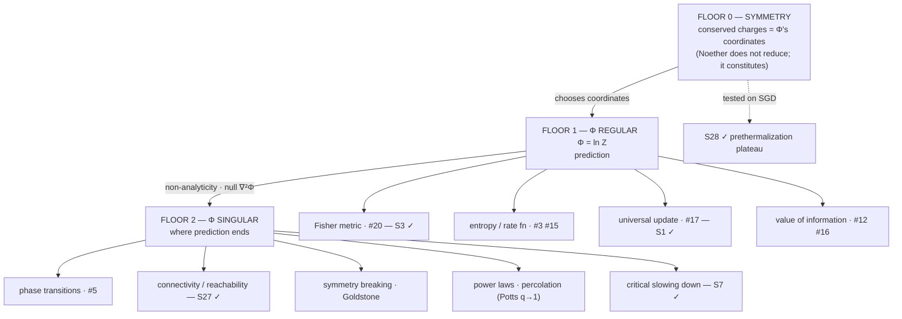

# State of the map — synthesis

*Snapshot: 2026-07-24, after five expansion⇄restraint cycles.*

This document makes the whole structure legible in one read. It is the one place
that says what we're doing, what has actually been established, what is still a
speculative stone, and the through-line that has emerged. Everything here links to
its source; nothing here is a new claim.

---

## 1. In one paragraph

We are mapping **cross-domain invariants** — laws and structures that recur across
fields — and, above all, telling the real ones from seductive analogies by placing
each on an explicit [ladder of rigor](./METHODOLOGY.md) (L0 metaphor → L4 provable
universality). Two structural ideas emerged from the work itself: (a) the object we
are mapping is best understood as a **[prediction field](./PREDICTION-FIELD.md)** —
the measurement-invariant predictive structure of a system; and (b) a large *core*
of the catalog collapses onto a single scalar, the **[free-energy hub](./invariants/free-energy-hub.md)**
Φ = ln Z, whose derivatives *are* the recurring objects. Restraint passes since have
replaced the flat "core + independent periphery" picture with a layered one:
**one object, three floors — chosen by symmetry, read by prediction, ended by
breakdown.**

---

## 2. The method, in one picture

- **The ladder.** Every correspondence gets a level: L0 word · L1 structure ·
  L2 same math · L3 same mechanism · L4 provable universality. An entry isn't done
  until it states its level *and* where it breaks.
- **The rhythm.** Two strokes: **expansion** (make leaps — home:
  [`SPECULATIVE.md`](./questions/SPECULATIVE.md)) and **restraint** (test, prune —
  home: [`experiments/`](./experiments/), [`derivations/`](./derivations/),
  [`OPEN-QUESTIONS.md`](./questions/OPEN-QUESTIONS.md)). Expansion without restraint
  is confabulation; restraint without expansion is bookkeeping. Leaps that survive
  a falsifier graduate; leaps that die are logged and marked L1.
- **The method is *not* an instance of its own subject.** Probed and retired —
  [`essay3-method-as-update.md`](./derivations/essay3-method-as-update.md).
  Expansion provably lies outside the universal update (multiplicative updates
  preserve zeros, so support growth is impossible for mirror descent); the method
  is a **replicator–mutator with a zero-sum attention budget**, of which only the
  *selection* term is S1's object. Worth stating here because the tempting
  self-licensing loop — "our method is the law we discovered" — is closed off by a
  lemma rather than by taste.

---

## 3. What actually has teeth — the ledger

The honest core of the synthesis. Each result survived a restraint pass; each
carries its own limit. Negative and split verdicts are listed alongside the
confirmations — they are the same kind of evidence.

| # | Result | How | Verdict | The limit we wrote down |
|---|--------|-----|---------|-------------------------|
| **S1** | [Replicator = MW = Bayes = Gibbs](./derivations/S1-universal-update.md) | derivation | **L3, exact** — all are `x_i ∝ x_i·e^{−η g_i}` (entropic mirror descent); bonus L3: free energy = −log-evidence = log-loss = −log-growth | *Global* dynamics **not** shared — game-coupled losses cycle forever; "they converge alike" retired to L1 |
| **S3** | [Fisher curvature spikes at transitions](./experiments/S3-fisher-geometry/) | experiment | **strong L2** — χ→∞ at Ising T_c (exact); inverse-Fisher blows up exactly at the double-descent test-error peak | A Fisher-magnitude *proxy*, not full Riemann curvature; **grokking** untested |
| **S18** | [Invariance predicts transfer](./experiments/S18-invariance-transfer/) | experiment | **frame's falsifier survived** — train-invariance ranks held-out transfer at ρ=0.985; spurious feature best in-distribution, worst on transfer | Constructed SCM where invariance = causation *by design* |
| **§6.1** | [Ladder level predicts transfer](./experiments/ladder-vs-transfer/) | experiment | **confirmed + sharpened** — across different mechanisms, transfer skill has a *cliff at the L2/L3 boundary* (0.03 / 0.48 / 0.92 / 0.89) | Controlled within the CLT family; synthetic; L3≈L4 so it's a step, not a ramp |
| **S23** | [Attention = the universal update](./experiments/S23-attention-bayes/) | derivation + experiment | **exact** — softmax attention = a Bayesian update over memories to 1.4e-17; attention temperature = η = 1/σ² | Single-head, single-step, Gaussian memory; nets learn β rather than set it optimally |
| **§6.1** | [The frame on real data](./experiments/real-transfer/) | experiment | **passed** — invariance predicts transfer at ρ=0.983 on the real diabetes dataset; Benford transfers across 2ⁿ/3ⁿ/n!/Fibonacci (0.97) and fails on controls (0.00) | Leg A has a signal-strength confound; Leg B's domains are computable sequences |
| **S25** | [The RLCT charts Φ where the Fisher metric degenerates](./experiments/S25-rlct-singularity/) | experiment | **confirmed, all registered predictions** — free-energy slopes recover exact RLCTs (0.508 vs ½ where d/2=1); λ(P)=min(P,D)/2 with a kink at P=D; Bayes excess risk *and* covariate-shift transfer error plateau with λ (ratio 0.97 vs d-scaling's 3) | Rank-type (simplest) singularities; covariate shift ≠ cross-domain transfer |
| **S26** | [Is degeneracy an *attractor* of learning?](./experiments/S26-llc-trajectory/) | experiment | **falsified as stated; deflationary survivor** — endpoint deeply singular (λ̂=1.38 vs d/2=8) **but** noiseless full-batch GD lands at the same λ̂=1.40 and post-convergence λ̂ drifts up. Degeneracy is where you end up, not what pulls you | λ̂ is meaningless off-criticality; plateau-rich (grokking) tasks are the escalation |
| **S27** | [Does control split into a Φ-half and an irreducible half?](./derivations/S27-control-split.md) | derivation | **falsifier fired, conjecture upgraded** — controllability Gramian ≡ covariance of the noise-driven ensemble (∇²Φ); minimum control energy = large-deviations rate function (Legendre dual of Φ), exact linear-Gaussian, Freidlin–Wentzell beyond. Replacement claim: **connectivity facts are Φ-boundary facts** | The reduction lands binary reachability in Φ's *singular set* (supports, null Fisher, I=∞), never its regular part — a boundary, not a derivative |
| **—** | [Does symmetry reduce to Φ, or is it a second primitive?](./derivations/symmetry-sector.md) | derivation | **split verdict — monism fails, but so does "second sector"** — symmetry-*breaking* reduces fully to Φ-singular (no SSB without a non-analyticity; Goldstone modes = null ∇²Φ), while Noether proper does **not** reduce (Φ has a measure, not a bracket) and instead *constitutes*: charges are the natural parameters of long-time ensembles | Structural, not empirical; the constitution half is a conjecture promoted to S28, not a theorem about arbitrary prediction fields |
| **S28(iii)** | [SGD's stationary law is coordinatized by its charges](./experiments/S28-sgd-charges/) | experiment | **falsifier did not fire; result sharper than the claim** — Q conserved in the flow limit (drift ∝ lr); weight-decay breaking obeys dQ/dt = −4λQ to 1e-5; stationary norm √(Q²+4w*²) predicted from the charge alone to 3e-4. SGD's stationary law is a **prethermalization plateau coordinatized by quasi-charges** | Charge erodes at 5.6e-7/step ⇒ ~1.8M-step quasi-conservation window: the claim is explicitly *timescale-indexed*. Minimal scale-symmetric model only |
| **S7** | [Critical slowing down as one signal](./experiments/S7-critical-slowing/) | experiment | **split** — τ·λ_min = 0.94±0.13 across saddle-node / mean-field Ising / GD at the MP edge: one mechanism (curvature softening), L3 on-model. Critical slowing = **Φ's Hessian going soft** | The universal-*exponent* reading retired to L1 (−½ / −1 / −2 by domain); quartic dominance nearest T_c degrades the linear law |
| **—** | [Is the method an instance of the universal update?](./derivations/essay3-method-as-update.md) | derivation | **retired as stated** — expansion is provably outside (★); the method is a replicator–mutator, only its selection term is S1's object | The attention-allocation face survives as unfalsifiable-for-now (L1–L2): it needs ≥3 log epochs at deliberately varied tempo |

The remaining 17 stones in [`SPECULATIVE.md`](./questions/SPECULATIVE.md) carry
falsifiers but have not been worked — see §6.1.

---

## 4. The through-line: one object, three floors

The 2026-07-19 snapshot said *core + independent periphery*, with a "tantalizing
secondary thread" that power laws live where Φ misbehaves. Restraint passes moved
the architecture twice in one day — three sectors → two layers → a tower — and in
doing so promoted that secondary thread to the load-bearing one.

**Floor 0 — symmetry chooses the coordinates.** Noether proper does not reduce to
Φ: Φ carries a measure, not a bracket, so the structural ingredient a conservation
theorem needs simply isn't there. But the relation inverts. A quantity can be a
natural parameter of an invariant ensemble *iff* it is conserved, and long-time
ensembles are parameterized by nothing but their charges (plain Gibbs when
thermalizing, GGE when integrable — Jaynes read backwards). Symmetry sits **under**
Φ, fixing what Φ's arguments are.
([`symmetry-sector.md`](./derivations/symmetry-sector.md), stone
[S28](./questions/SPECULATIVE.md).)

**Floor 1 — the regular part of Φ predicts.** The original hub, unchanged: value,
gradient, Hessian, Legendre dual.

**Floor 2 — the singular part of Φ ends prediction.** This is the correction. Much
of what was filed as an "independent periphery" is Φ's *boundary*:
connectivity/reachability facts, symmetry breaking, power laws, percolation via the
Potts q→1 non-analyticity. These resisted reduction to Φ's derivatives because they
are not derivatives — they are singularities.

| Read of Φ | Is | Catalog entry | Status |
|-----------|----|---------------|--------|
| *coordinates of* Φ | conserved charges / sufficient statistics | [conservation-noether](./invariants/conservation-noether.md) | **S28**, tested on SGD ✓ |
| value −Φ | free energy = −log-evidence = log-loss = −log-growth | [#17 universal update](./invariants/mirror-descent-update.md) | L3 ✓ (S1) |
| ∇Φ | observables / means | — | — |
| ∇²Φ | Fisher metric = susceptibility = fluctuations | [#20 statistical geometry](./invariants/statistical-geometry.md) | tested ✓ (S3) |
| Legendre dual Φ* | entropy / rate function / **minimum control energy** | [#3](./invariants/entropy-information.md), [#15](./invariants/duality.md), [feedback-control](./invariants/feedback-control.md) | L3/L2; control leg via S27 |
| non-analyticity of Φ | phase transitions (Lee–Yang) · **symmetry breaking** | [#5 criticality](./invariants/criticality-phase-transitions.md), [symmetry-breaking](./invariants/symmetry-breaking.md) | L4 core; SSB via symmetry-sector |
| **singular set of ∇²Φ** | reachability failure · Goldstone modes · critical slowing · RLCT | [spectral-gap](./invariants/spectral-gap.md), [critical-slowing-down](./invariants/critical-slowing-down.md) | **four independent arrivals** |
| log-growth face | value of information | [#12](./invariants/selection-replicator.md), [#16](./invariants/information-bottleneck.md) | L2–L3 |

**The ∇²Φ singular set has now been reached four independent times**, from four
directions: S3's Fisher divergences at transitions, S27's unreachable null spaces,
the symmetry sector's Goldstone flat directions, and S7's slow mode. Four arrivals
at one object by four unrelated routes is the strongest structural evidence the map
has produced — stronger than any single reduction, because none of the four was
designed to land there.

**Honest scope.** The tower is an *architecture* claim, and it is younger than the
hub claim it replaces. What is demonstrated: the specific reductions above, each
inside its stated model class. What is not: that every catalog entry sorts into
exactly one floor; that "the sufficient statistics of a stationary prediction field
are its conserved quantities" holds beyond physics and the single SGD model tested;
or that no third axis exists. The symmetry sector was the last standing candidate
for a second axis, and it resolved into a *floor* — a weaker and more interesting
outcome than either monism or dualism.

---

## 5. The map at a glance

- **1 frame:** the prediction field (🟢 operational core, empirically load-bearing
  via S18 + real-transfer).
- **1 object, 3 floors:** symmetry → Φ-regular → Φ-singular.
- **~6 hub-core invariants** (developing): the Φ-facets above.
- **~10 former-periphery invariants:** most now re-read as Φ-boundary facts rather
  than independent invariants. [`feedback-control`](./invariants/feedback-control.md)
  is flagged for promotion from seed on the strength of S27.
- **28 speculative stones (S1–S28); 11 have had a restraint pass**, 17 have not.
- **10 experiments + 5 derivations** with teeth.
- **4 essays** ([`essays/`](./essays/)) — philosophy grounded in the ledger, no
  ladder levels, carrying ⟳ restraint notes rather than silent edits.

> **Numbering note (2026-07-24).** Cluster K was filed on 2026-07-22 reusing the
> numbers S25/S26, which Cluster G already held. The Cluster K stones are now
> **S27** (control split, `derivations/S27-control-split.md`) and **S28** (charges
> as coordinates, `experiments/S28-sgd-charges/`). Research-log entries dated
> before 2026-07-24 use the old numbers and were left as written.

Full catalog: [`invariants/README.md`](./invariants/README.md). The
invariant × domain matrix: [`domains/README.md`](./domains/README.md).

---

## 6. The open frontier (prioritized)

1. **The unworked-stone backlog (P0, and it is large).** S2, S4–S6, S8, S10–S17,
   S19–S22, S24 have never had a restraint pass. This is now the biggest single
   source of unearned confidence in the map: the tower was built by working the
   stones that were *interesting*, not the ones that were *cheap*, and cheap
   unworked stones are exactly where a quiet counterexample would sit. Cheapest
   next: **S5** (three thresholds — Shannon capacity / Eigen error catastrophe /
   fault-tolerance) and **S22** (the ladder as an RG scale).
2. **Does the tower have a floor it doesn't know about? (P1)** The architecture
   predicts every catalog entry sorts into symmetry / Φ-regular / Φ-singular. Run
   that sort explicitly across all ~24 invariants and see what refuses — a genuine
   refusal is worth more than another confirmation.
3. **Redundancy deletion (P0, still open).** Formalize "how much of the catalog is
   Φ." If #3 and #16 are facets, the catalog should say so and stop double-counting.
   The tower makes this sharper, not softer: entries should be deleted *or*
   relabeled by floor.
4. **S28 beyond the minimal model (P1).** Matrix / deep / ReLU charges;
   minibatch-only noise; does the quasi-conservation window scale the way the
   prethermalization reading predicts?
5. **Grokking / Lee–Yang (P1, S13).** Does a genuine grokking transition show a
   non-analyticity of the appropriate Φ? Closes the gap S3 left open, and is also
   the escalation target S26 named.
6. **The attention-tempo test (P2 — needs time, not cleverness).** The one surviving
   face of "the method is an instance of its own subject" needs ≥3 log epochs at
   deliberately different expansion/restraint tempos before it is falsifiable. The
   log gains value for this simply by accumulating dated sessions.

The frame's real-transfer frontier is **no longer P0**: three passes (S18,
ladder-vs-transfer, real-transfer) made it empirically load-bearing. What remains
there is breaking Leg A's signal-strength confound and a many-field study — real
work, but no longer the thing most likely to overturn something.

---

## 7. What the process is showing

Five cycles in, the pattern worth naming is that **the restraint passes have been
more generative than the expansions**. The tower was not proposed and then
confirmed; it was arrived at by three stones dying in useful ways — S27's
"irreducible" half reducing, the symmetry sector refusing both monism and dualism,
essay 3's self-description failing to a lemma. Each time the falsifier fired, the
replacement claim was *stronger and narrower* than what it replaced. That is the
method working as advertised, and it is also a warning: a map whose architecture
changed twice in one week is not yet a map whose architecture should be trusted.
The next stroke that matters most is §6.1 — the boring backlog — precisely because
everything sharp so far came from stones chosen for being sharp.

---

## How to read this repo

Start here → [`README.md`](./README.md) · method → [`METHODOLOGY.md`](./METHODOLOGY.md)
· frame → [`PREDICTION-FIELD.md`](./PREDICTION-FIELD.md) · center →
[`invariants/free-energy-hub.md`](./invariants/free-energy-hub.md) · what's proven →
[`experiments/`](./experiments/) + [`derivations/`](./derivations/) · the arguments →
[`essays/`](./essays/) · what's next → [`questions/`](./questions/) · the running
record → [`research-log/`](./research-log/).
