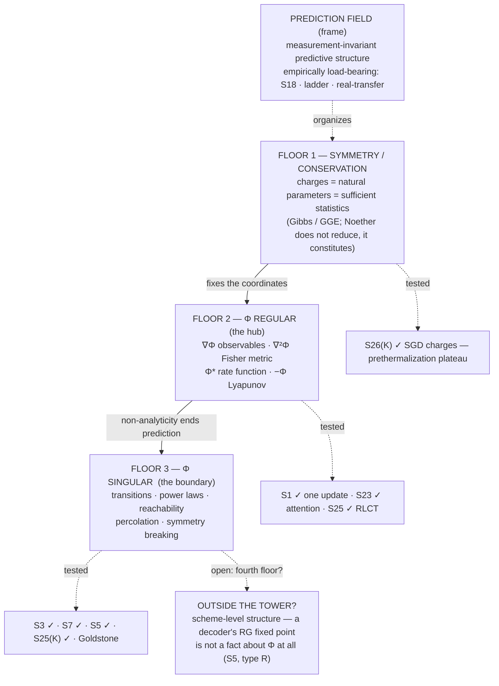

# State of the map — synthesis

*Snapshot: 2026-07-25. Supersedes the 2026-07-19 snapshot, whose through-line
("much of the map is one object seen sideways") has since been corrected twice —
three sectors → two layers → one tower.*

This document makes the whole structure legible in one read: what we're doing,
what has actually been established, what is still a speculative stone, and the
architecture that has emerged. Everything here links to its source; nothing here
is a new claim.

---

## 1. In one paragraph

We are mapping **cross-domain invariants** — laws and structures that recur across
fields — and, above all, telling the real ones from seductive analogies by placing
each on an explicit [ladder of rigor](./METHODOLOGY.md) (L0 metaphor → L4 provable
universality). Three structural results have come out of the work itself: (a) the
object we map is best understood as a **[prediction field](./PREDICTION-FIELD.md)**,
and that frame is now *empirically load-bearing*, not merely self-consistent;
(b) a large core of the catalog collapses onto one scalar, the
**[free-energy hub](./invariants/free-energy-hub.md)** Φ = ln Z, whose derivatives
*are* the recurring objects; and (c) the collapse is **not monism** — the map is a
**tower with three floors**: symmetry chooses Φ's coordinates, Φ's regular part
predicts, Φ's singular part is where prediction ends. The slogan:
**one object, three floors — chosen by symmetry, read by prediction, ended by
breakdown.**

---

## 2. The method, in one picture

- **The ladder.** Every correspondence gets a level: L0 word · L1 structure ·
  L2 same math · L3 same mechanism · L4 provable universality. An entry isn't done
  until it states its level *and* where it breaks.
- **The rhythm.** Two strokes: **expansion** (make leaps — home:
  [`SPECULATIVE.md`](./questions/SPECULATIVE.md)) and **restraint** (test, prune —
  home: [`experiments/`](./experiments/), [`derivations/`](./derivations/)).
  Expansion without restraint is confabulation; restraint without expansion is
  bookkeeping. Leaps that survive a falsifier graduate; leaps that die are logged
  and marked L1 — and, as §7 records, the ones that die have been the more
  productive half.

---

## 3. What actually has teeth — the ledger

Every result that survived a restraint pass, with the limit we wrote down for it.

### The frame and its falsifier

| # | Result | How | Verdict | The limit |
|---|--------|-----|---------|-----------|
| **S18** | [Invariance predicts transfer](./experiments/S18-invariance-transfer/) | experiment | **frame's falsifier survived** — train-invariance ranks held-out transfer at ρ=0.985; the best in-distribution feature is the worst-transferring | constructed SCM where invariance = causation by design |
| **§6** | [Ladder level predicts transfer](./experiments/ladder-vs-transfer/) | experiment | **confirmed, then corrected** ([paper 1](./paper/transfer-cliff.md)) — level orders transfer (0.03/0.48/0.92/0.89) and mechanism and theorem transfer equally. The "cliff at L2/L3" *step* reading is **retracted** (L1→L2 = 0.451 ≈ L2→L3 = 0.432); what is real is a **ceiling** — L3/L4 reach complete transfer (measured ceiling 0.920±0.023), L2 saturates at ~0.54 forever | controlled within the CLT family; synthetic |
| **§6** | [The frame on real data](./experiments/real-transfer/) | experiment | **passed** — invariance predicts transfer at ρ=0.983 on the diabetes dataset; Benford transfers across 2ⁿ/3ⁿ/n!/Fibonacci (0.97), fails on controls (0.00) | Leg A has a signal-strength confound; multi-field study still open |
| **S25** | [Channel-independence of the singularities](./experiments/S25-channel-independence/) | experiment | **🔴 tier tested, did not promote** — singularities are *invariant* under generic channels and *covariant* under structured ones: F_c(T)=F_eff(T′)(dT′/dT)² exact to 1e-14 | one pre-registration error on record (parity blind only at odd N) |

### The hub and its facets

| # | Result | How | Verdict | The limit |
|---|--------|-----|---------|-----------|
| **S1** | [Replicator = MW = Bayes = Gibbs](./derivations/S1-universal-update.md) | derivation | **L3, exact** — all are `x_i ∝ x_i·e^{−η g_i}`; free energy = −log-evidence = log-loss = −log-growth | *global* dynamics not shared — game-coupled losses cycle forever (L1) |
| **S23** | [Attention = the universal update](./experiments/S23-attention-bayes/) | derivation + experiment | **exact** — softmax attention = a Bayesian update over memories to 1.4e-17; attention temperature = η = 1/σ² | single-head, single-step, Gaussian memory |
| **S3** | [Fisher curvature spikes at transitions](./experiments/S3-fisher-geometry/) | experiment | **strong L2** — χ→∞ at Ising T_c; inverse-Fisher blows up exactly at the double-descent peak | a Fisher-*magnitude* proxy, not full curvature; grokking untested |
| **S25** | [The RLCT prices the singular field](./experiments/S25-rlct-singularity/) | experiment | **confirmed, all registered predictions** — free-energy slopes recover exact RLCTs (0.508 vs ½ where d/2=1); risk *and* covariate-shift transfer plateau with λ, not d | rank-type singularities; shift ≠ cross-domain transfer |
| — | [Channels stay near one-parameter](./derivations/S25-one-parameterness.md) | derivation | **proved**, with the exact obstruction identified and numerically verified | Boltzmann families |

### The architecture (this is what changed)

| # | Result | How | Verdict | The limit |
|---|--------|-----|---------|-----------|
| **S25(K)** | [Control splits — and the "irreducible" half reduces](./derivations/S25-control-split.md) | derivation | **falsifier fired, conjecture upgraded** — Gramian ≡ ∇²Φ of the noise-driven ensemble; min control energy = Legendre dual of Φ. But binary reachability lands in Φ's *singular* set. **Connectivity facts are Φ-boundary facts** | exact linear-Gaussian; Freidlin–Wentzell beyond |
| — | [The symmetry sector](./derivations/symmetry-sector.md) | derivation | **monism fails, "second sector" also fails** — SSB reduces to Φ-singular; Noether does *not* reduce but **constitutes**: conserved charges are the natural parameters of long-time ensembles. Architecture: **one tower, three floors** | equilibrium/long-time only; GGE exhaustiveness heuristic away from integrability |
| **S26(K)** | [SGD's stationary law is charge-coordinatized](./experiments/S26-sgd-charges/) | experiment | **falsifier did not fire; sharper than the claim** — weight-decay breaking obeys dQ/dt = −4λQ to 1e-5; stationary norm from the charge alone to 3e-4; a **prethermalization plateau** with a ~1.8M-step window | minimal scale-symmetric model; claim is now timescale-indexed |
| **S26(J)** | [Is degeneracy an attractor?](./experiments/S26-llc-trajectory/) | experiment | **attractor claim falsified** — endpoint deeply singular (λ̂=1.38 vs d/2=8) but λ̂ drifts *up* post-convergence and noiseless GD lands identically. Survivor: **the low-loss set is generically singular** — degeneracy is where you end up, not what pulls you | λ̂ meaningless at non-critical points; grokking is the escalation |
| **P-A** | [The spectral gap is a null direction](./experiments/PA-spectral-gap/) | experiment | **the sort's first prediction, cashed** — #19's floor-3 assignment confirmed with Φ fixed in advance (Λ''·gap = 2⟨f,v₂⟩² = 2.0000), but *directional*: orthogonal to the slow mode Λ'' is unchanged while the gap falls 31×. "One number" demoted to one mechanism with constants spanning 1.54× | 3 of #19's 4 readouts are one number by construction; reversible chains only; one registered threshold failed as written |
| **P-D** | [Allometry is a log-ratio, not a Φ-derivative](./experiments/PD-allometry-reduction/) | experiment | **the sort's only *negative*, cashed** — θ = **min(1, ln n/−ln(β²γ))** to 7.1e-11, n cancelling to 4.0e-15. Blind to six decades of six magnitudes (1.1e-8), responsive to structural counts. Optimization is a **selector, not a source**: six cost functionals → six β, θ recovered from (β,γ) alone. **The variational route gives θ = 1, not 3/4.** ∇²log Z **rank 1 for every λ** (control swings 151%). Second route: θ = d/(d+1) | models of allometry, not organisms; P8 measures rank, doesn't prove no Φ exists; two registered items failed (MST construction, mean-field control) |
| — | [The catalog, sorted by floor](./invariants/FLOORS.md) | audit against the derivation | **sorted, and it deletes** — seven facet-faces are one convex function differentiated seven ways (▸facet); effective independent count 23 → ~16. Asymmetry found: **floor 2 collapses, floor 3 stratifies**. **Two entries refused the tower outright** (plus the type-R half of a third), all with the same signature: a log-ratio exponent | assignments for `seed` entries are *predictions*, not findings — #6, #9, #10, #19, #21, #22 and #4's reduction now rest on evidence; the rest do not |

### Where "one law" claims keep landing

| # | Result | How | Verdict | The limit |
|---|--------|-----|---------|-----------|
| **S7** | [Critical slowing down](./experiments/S7-critical-slowing/) | experiment | **mechanism confirmed, exponent refuted** — τ·λ_min = 0.94±0.13 across saddle-node/Ising/GD-at-the-MP-edge, no tuning; divergence exponents domain-specific (−½/−1/−2) | mean-field models; near-critical quartic bias documented |
| **S5** | [Three noise thresholds](./experiments/S5-noise-thresholds/) | experiment | **falsifier fires — exponents span 1.00→3.17** — and the variation is *within* domains, not across them. Replacement: α is a **degeneracy order** — 2 for a smooth metric merge (forced by the Fisher expansion), 1 for support loss, ln n₀/ln(t+1) for a decoder's RG fixed point. α = order of vanishing of χ²_sym to 0.0015 | concatenation ≠ fault tolerance as such (LDPC gives O(1) overhead); binary-input memoryless channels; orders 1 and 2 only |
| — | [Is the method itself the universal update?](./derivations/essay3-method-as-update.md) | derivation | **retired as stated** — the method is a *replicator–mutator*: expansion provably lies outside (★), since multiplicative updates preserve zeros | attention face L1–L2, revival condition is a designed multi-epoch test |

---

## 4. The through-line: one object, three floors

The 2026-07-19 synthesis said the map was "one object seen sideways." Two
derivations corrected that. The reduction *is* real and it went further than
expected — feedback/control, reachability, percolation and symmetry-breaking all
collapsed inward — but the thing they collapsed into is layered, and one piece
refused to collapse at all and turned out to sit *underneath*:

```
  symmetry / conservation   →  chooses Φ's coordinates   (which quantities exist)
  Φ, regular part           →  prediction                (moments, Fisher, updates)
  Φ, singular part          →  boundaries                (transitions, power laws,
                                                          reachability, percolation, SSB)
```

The direction of explanation runs bottom-up, which is exactly why every attempt to
express Noether *inside* Φ-machinery failed while the converse kept succeeding:
Noether's theorem consumes a bracket, Φ has only a measure. What survives into a
stationary prediction field is what is conserved — Jaynes read in reverse.



**What sorting the catalog against it revealed.** Running every entry through the
tower ([`invariants/FLOORS.md`](./invariants/FLOORS.md)) exposed an asymmetry the
old "one object seen sideways" slogan could not express:

> **Floor 2 collapses. Floor 3 stratifies.**

The regular part of Φ really is one function seen from seven angles — entropy,
duality, the bottleneck, the universal update, replicator dynamics, Pareto
frontiers and statistical geometry are ∇Φ, ∇²Φ, Φ* or −Φ of the *same* convex
function, and the catalog now marks them ▸facet and stops double-counting them.
The singular part does **not** collapse: criticality, power laws, percolation,
SSB, slowing-down and the noise thresholds are *different* singularities —
non-analyticity, divergent moments, null directions, lost supports — and
[S5](./experiments/S5-noise-thresholds/) measured that they carry *different
exponents*. Redundancy deletion is a floor-2 operation; floor 3 needs
classification instead.

**Honest scope.** The tower is derived for equilibrium / long-time (stationary)
prediction fields. Driven, non-stationary systems can carry non-conserved
quantities in their description indefinitely, and the base-floor claim does not
reach them. GGE exhaustiveness is exact for integrable systems and
standard-but-heuristic elsewhere.

---

## 5. The most-arrived-at object in the repo

The single strongest empirical regularity in this project is not any one
invariant. It is that **independent lines of attack keep landing on the singular
set of ∇²Φ** — the same object, reached five times, from five directions, by
people (well, passes) looking for different things:

| Arrival | Route | What it saw there |
|---------|-------|-------------------|
| 1 | [S3](./experiments/S3-fisher-geometry/) | **divergence** — χ→∞ at T_c, inverse-Fisher→∞ at double descent |
| 2 | [S25(K)](./derivations/S25-control-split.md) | **null spaces** — unreachable directions are null Fisher directions / support facts |
| 3 | [symmetry sector](./derivations/symmetry-sector.md) | **flat directions** — Goldstone modes are null directions of ∇²Φ |
| 4 | [S7](./experiments/S7-critical-slowing/), sharpened by [P-A](./experiments/PA-spectral-gap/) | **the slow mode** — τ = 1/λ_min; critical slowing is the Hessian going soft. P-A found *which* Hessian: in a double well the gap falls 3540× while the local curvature **rises** 6×, so S7's law is a **single-basin** law and the general object is the trajectory free energy's Hessian |
| 5 | [S5](./experiments/S5-noise-thresholds/) | **the order of the degeneracy** — the redundancy exponent counts how fast the induced Fisher information vanishes (2 = metric merge, 1 = support loss) |

[The RLCT result](./experiments/S25-rlct-singularity/) is best read not as a sixth
arrival but as the *quantification* of the same object: λ is the chart of the
region where the metric degenerates, and it — not parameter count — prices
generalization and transfer.

Arrival 5 is the one that changed the picture, because it is the first to
**measure the order** rather than note the singularity. Both of S25's named
singular faces (null Fisher directions; supports) turn up in the same experiment
carrying *different exponents* — which is precisely why S5's "one threshold, one
exponent" premise had to fail.

---

## 6. The map at a glance

- **1 frame:** the prediction field (🟢 core empirically load-bearing; 🔴 metaphysical
  reading tested once and explicitly *not* promoted).
- **1 hub:** Φ = ln Z (L3; L4 via Lee–Yang).
- **3 floors:** symmetry-constituted · Φ-regular · Φ-singular — plus a **proposed
  fourth** (the scheme layer), which is equally the tower's falsifier.
- **23 catalog entries, [now sorted](./invariants/FLOORS.md)**: 1 hub, 1 on floor 1,
  6 floor-2 facets (▸ deleted as independent), 2 floor-2 non-facets, 6 distinct
  floor-3 members, 5 splitting across floors, **2 refusing the tower**. Effective
  independent count **~16**. There is no longer an unexamined "periphery" — every
  entry now carries a floor and a reason.
- **28 speculative stones** (S1–S26, with two number collisions — see §8).
  **Worked:** S1, S3, S5, S7, S9 (sharpened), S11 (strong form falsified), S18,
  S23, S25(J), S25(K), S26(J), S26(K). **Unworked:** S2, S4, S6, S8, S10, S12–S17,
  S19–S22, S24.
- **12 experiments + 5 derivations** with teeth; **4 essays**.

Full catalog: [`invariants/README.md`](./invariants/README.md). The
invariant × domain matrix: [`domains/README.md`](./domains/README.md).

---

## 7. The open frontier (reprioritized)

1. **Is there a fourth floor? (P0 — now the map's sharpest question.)** The tower's
   own falsifier #4 asks for an invariant reducible to none of the three floors.
   [Sorting the catalog](./invariants/FLOORS.md) produced not one candidate but a
   *cluster*, and they share a signature: **their invariant is a log-ratio —
   log(multiplicity) over log(rescaling) — not a derivative of Φ.** S5's
   concatenation exponent ln n₀/ln(t+1) is literally of the same form as a fractal
   dimension ln N/ln b; RG eigenvalues are the general case; a code is a designed
   one; double-entry accounting is a trivial one, conserving *because of the
   representation*. So the catalog's oldest embarrassment (accounting
   "conservation" that isn't Noether) and its newest result (S5's type R) land in
   the same bin — facts about the **description map**, not about the system's
   prediction field. **The live question is not whether they are separate from
   floors 2–3 but whether they collapse into floor 1**: a code *is* a redundancy
   chosen to be invariant under the noise, and "invariance chooses the
   coordinates" is exactly floor 1's job. Two-sided falsifier in
   [`FLOORS.md`](./invariants/FLOORS.md) §4.
   **First evidence, from [P-D](./experiments/PD-allometry-reduction/).** The bin
   now has a *second measured* member, and this one was a prediction rather than a
   retrofit: allometry's θ = min(1, ln n/−ln(β²γ)) is the same log-ratio form,
   blind to magnitudes (1.1e-8 over six decades of six quantities) and responsive
   only to structural counts. It also touches the live horn directly. Allometry's
   ratios really *are* selected by floor-1-flavoured conditions — impedance
   matching is flux-matching, space-filling is a geometric constraint — so the
   scheme layer **takes input from** floor 1, exactly as the second horn predicted.
   But the log-ratio is terminal: there is no Φ downstream, and the exponential
   family's ∇²log Z is rank 1 for every parameter value, so no conjugate pair
   exists for the exponent to be an exchange rate between. *Takes input from*, not
   *is* — one instance, not a settlement. Two side benefits: the floor-3/floor-4
   boundary is now a measurement (floor 3's supports are singular *on a set*; the
   scheme layer's covariance is rank-deficient **everywhere**), and a scheme
   exponent can be non-analytic in a scheme parameter with no Φ non-analytic in a
   thermodynamic one — θ = min(1,·) has a kink, and Murray's law sits on it.
2. **Cash the rest of the sort's predictions (P1).** **P-A and P-D are both done.**
   [P-A](./experiments/PA-spectral-gap/): #19's floor-3 assignment holds in the
   directional form, and it cost S7 a boundary condition.
   [P-D](./experiments/PD-allometry-reduction/): the sort's only negative,
   confirmed on every registered leg — and the variational route that *would* have
   reduced allometry to floor 2 gives θ = 1, not 3/4. So the sort has now been
   graded on a positive and on a negative, both about `seed` entries, and survived
   both. Remaining: **P-C**, that variational principles come in exactly two
   kinds — now the most interesting of the three, because P-D showed an
   optimization can be real and still not put its exponent on floor 2, which is a
   third possibility P-C's binary does not have a slot for; and **P-B**'s untested
   half.
3. **Grokking / Lee–Yang (P1, S13).** Does a genuine grokking transition show a
   non-analyticity of the appropriate Φ? Closes the gap S3 left open, and
   [S26(J)](./experiments/S26-llc-trajectory/) named plateau-rich tasks as the
   escalation for the same machinery.
4. **Multi-field real transfer (P1).** Break Leg A's signal-strength confound and
   run many *different* real datasets from *different* fields.
5. **FDT in learning (P1, S15).** Response = SGD-fluctuation covariance? The
   out-of-equilibrium violation may itself be the invariant. Cheap numpy test,
   still unworked.
6. **S9's L3 route (P2).** Exhibit the momentum map as the shared generative
   object across symplectic and metric structures, and Noether-for-learning
   promotes from L2.

---

## 8. What the process is showing

Six cycles in, two patterns have become hard to miss.

**The falsifiers that fire produce more structure than the ones that survive.**
S25(K) fired and upgraded to "connectivity facts are Φ-boundary facts." S26(J)
fired and left "the low-loss set is generically singular." S7 refuted its exponent
claim and confirmed its mechanism. S5 fired and left a three-class taxonomy with
derived exponents. Essay 3's self-referential claim died and located an exact
boundary (multiplicative updates preserve zeros). The pattern is consistent enough
to be a working expectation: *a stone that dies at the quantitative level usually
dies into a mechanism.*

**"One law" claims fail at the exponent and survive at the mechanism.** S7 and S5
are independent instances of exactly the same shape: one relation holds across
domains with no tuning, while the exponents are domain- or scheme-specific. That
is the L3/L4 distinction the [methodology](./METHODOLOGY.md) drew on other
grounds, showing up unbidden in the results — the ladder predicting its own
findings. It also suggests where to aim: claims of the form "*the same mechanism*"
have been surviving; claims of the form "*the same number*" have not.

**Bookkeeping defect on record.** Two stone numbers were reused: **S25** names both
the RLCT stone (Cluster J) and the control-split stone (Cluster K), and **S26**
names both the degeneracy-attractor stone (J) and the conserved-charges stone (K).
This synthesis disambiguates with S25(J)/S25(K)/S26(J)/S26(K), and
[`SPECULATIVE.md`](./questions/SPECULATIVE.md) now carries forward-numbering for
Cluster K. The dated [research-log](./research-log/) entries are left as written —
they are a historical record, not an index.

---

## How to read this repo

Start here → [`README.md`](./README.md) · method → [`METHODOLOGY.md`](./METHODOLOGY.md)
· frame → [`PREDICTION-FIELD.md`](./PREDICTION-FIELD.md) · center →
[`invariants/free-energy-hub.md`](./invariants/free-energy-hub.md) · architecture →
[`derivations/symmetry-sector.md`](./derivations/symmetry-sector.md) · what's proven →
[`experiments/`](./experiments/) + [`derivations/`](./derivations/) · what's next →
[`questions/`](./questions/) · the running record → [`research-log/`](./research-log/).
