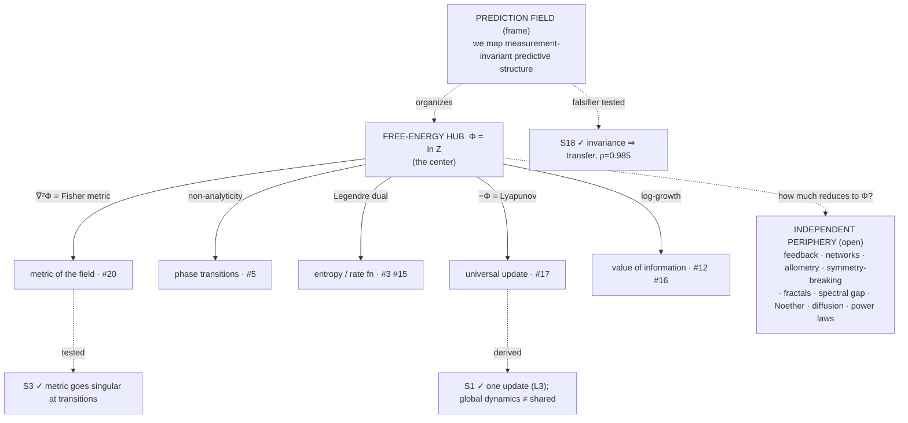

# State of the map — synthesis

*Snapshot: 2026-07-19, after three expansion⇄restraint cycles.*

This document makes the whole structure legible in one read. It is the one place
that says what we're doing, what has actually been established, what is still a
speculative stone, and the through-line that has emerged. Everything here links to
its source; nothing here is a new claim.

---

## 1. In one paragraph

We are mapping **cross-domain invariants** — laws and structures that recur across
fields — and, above all, telling the real ones from seductive analogies by placing
each on an explicit [ladder of rigor](./METHODOLOGY.md) (L0 metaphor → L4 provable
universality). Two structural ideas emerged from the work itself: (a) the object we
are mapping is best understood as a **[prediction field](./PREDICTION-FIELD.md)** —
the measurement-invariant predictive structure of a system; and (b) a large *core*
of the catalog collapses onto a single scalar, the **[free-energy hub](./invariants/free-energy-hub.md)**
Φ = ln Z, whose derivatives *are* the recurring objects. The emerging thesis:
**much of the map is one object seen sideways.**

---

## 2. The method, in one picture

- **The ladder.** Every correspondence gets a level: L0 word · L1 structure ·
  L2 same math · L3 same mechanism · L4 provable universality. An entry isn't done
  until it states its level *and* where it breaks.
- **The rhythm.** Two strokes: **expansion** (make leaps — home:
  [`SPECULATIVE.md`](./questions/SPECULATIVE.md)) and **restraint** (test, prune —
  home: [`experiments/`](./experiments/), [`derivations/`](./derivations/),
  [`OPEN-QUESTIONS.md`](./questions/OPEN-QUESTIONS.md)). Expansion without restraint
  is confabulation; restraint without expansion is bookkeeping. Leaps that survive
  a falsifier graduate; leaps that die are logged and marked L1.

---

## 3. What actually has teeth — the ledger

The honest core of the synthesis. Three results survived a restraint pass; each
carries its own limit.

| # | Result | How | Verdict | The limit we wrote down |
|---|--------|-----|---------|-------------------------|
| **S1** | [Replicator = MW = Bayes = Gibbs](./derivations/S1-universal-update.md) | derivation | **L3, exact** — all are `x_i ∝ x_i·e^{−η g_i}` (entropic mirror descent); bonus L3: free energy = −log-evidence = log-loss = −log-growth | *Global* dynamics **not** shared — game-coupled losses cycle forever; "they converge alike" retired to L1 |
| **S3** | [Fisher curvature spikes at transitions](./experiments/S3-fisher-geometry/) | experiment | **strong L2** — χ→∞ at Ising T_c (exact); inverse-Fisher blows up exactly at the double-descent test-error peak | A Fisher-magnitude *proxy*, not full Riemann curvature; **grokking** untested |
| **S18** | [Invariance predicts transfer](./experiments/S18-invariance-transfer/) | experiment | **frame's falsifier survived** — train-invariance ranks held-out transfer at ρ=0.985; spurious feature best in-distribution, worst on transfer | Constructed SCM where invariance = causation *by design*; real cross-domain test still open |
| **§6.1** | [Ladder level predicts transfer](./experiments/ladder-vs-transfer/) | experiment | **confirmed + sharpened** — across different mechanisms, transfer skill has a *cliff at the L2/L3 boundary* (0.03 / 0.48 / 0.92 / 0.89); mechanism and theorem transfer equally | Controlled within the CLT family; synthetic, not real data; L3≈L4 so it's a step, not a ramp |
| **S23** | [Attention = the universal update](./experiments/S23-attention-bayes/) | derivation + experiment | **exact** — softmax attention = a Bayesian update over memories to 1.4e-17; attention temperature = η = 1/σ²; attention now a confirmed L3 instance of #17 | Single-head, single-step, Gaussian memory model; multi-layer/head not shown; nets learn β rather than set it optimally |

Everything else in [`SPECULATIVE.md`](./questions/SPECULATIVE.md) (S2, S4–S17) is a
stone with a falsifier attached — not yet load-bearing.

---

## 4. The through-line: much of the map is one object seen sideways

The two big discoveries fit together. The prediction field has a natural scalar —
its log-partition function Φ = ln Z — and the catalog's recurring objects are its
derivatives, transforms, and singularities:

| Read of Φ | Is | Catalog entry | Status |
|-----------|----|---------------|--------|
| value −Φ | free energy = −log-evidence = log-loss = −log-growth | [#17 universal update](./invariants/mirror-descent-update.md) (Lyapunov) | L3 ✓ |
| ∇Φ | observables / means | — | — |
| ∇²Φ | Fisher metric = susceptibility = fluctuations | [#20 statistical geometry](./invariants/statistical-geometry.md) | tested ✓ (S3) |
| Legendre dual Φ* | entropy / large-deviations rate function | [#3 entropy-info](./invariants/entropy-information.md), [#15 duality](./invariants/duality.md) | L3/L2 |
| non-analyticity of Φ | phase transitions (Lee–Yang) | [#5 criticality](./invariants/criticality-phase-transitions.md) | L4 core |
| log-growth face | value of information | [#12 replicator](./invariants/selection-replicator.md), [#16 bottleneck](./invariants/information-bottleneck.md) | L2–L3 |

**Honest scope of the thesis.** The collapse is real but *partial*:

- **Hub-core (collapses onto Φ):** entropy/information, statistical geometry,
  criticality, duality, the universal update, value-of-information. The math is
  exact for exponential families.
- **Hub-adjacent (plausibly reducible, open):** diffusion (Gaussian = max-entropy),
  noise thresholds (free energy of codes), critical slowing down (Φ's Hessian
  softening). Not yet demonstrated.
- **Independent periphery (no clean Φ reduction):** feedback/control, networks/
  percolation, scaling/allometry, symmetry-breaking, fractals, spectral gap,
  conservation/Noether (a *symmetry* primitive, not a Φ-derivative). These may be
  genuinely separate invariants.

A tantalizing secondary thread: **power laws (#1) live where Φ misbehaves** — heavy
tails are exactly where the partition function or its moments diverge, i.e. the
scale-free world is the *complement* of the well-behaved exponential-family world.
So Φ may organize the map both by its derivatives (the core) and by its
singularities (criticality, power laws). Conjecture, not result.

---

## 5. The map at a glance

- **1 frame:** the prediction field (🟢 operational core tested via S18).
- **1 hub:** Φ = ln Z (L3, L4 via Lee–Yang).
- **~6 hub-core invariants** (developing): the Φ-facets above.
- **~10 periphery invariants** (seed): candidates not yet reduced or refuted.
- **24 speculative stones** (S1–S24): 4 cashed (S1, S3, S18, S23), 20 on the board.
  The newest six (S19–S24) build on this session's scaffolding — "learning is the
  thermodynamics of prediction" (S20–S22, S24) and "climbing the ladder is
  inference" (S19, S23 — S23 now confirmed).
- **4 experiments + 1 derivation** with teeth (S3, S18, ladder-vs-transfer, S23; S1).

Full catalog: [`invariants/README.md`](./invariants/README.md). The
invariant × domain matrix: [`domains/README.md`](./domains/README.md).

---

## 6. The open frontier (prioritized)

1. **The real transfer test (P0).** *Partially done — a controlled cross-mechanism
   version passed* ([`experiments/ladder-vs-transfer/`](./experiments/ladder-vs-transfer/)):
   holding the surface phenomenon fixed and varying only correspondence depth,
   transfer skill has a sharp **cliff at the L2/L3 boundary** (appearance→mechanism),
   with L3≈L4 (mechanism and theorem transfer equally well). That independently
   re-derived the methodology's central L2/L3 line from a transfer measurement. Still
   open — the version that makes the frame *empirically* load-bearing: *different*
   catalog invariants on *real* data, A→B. Highest stakes.
2. **Redundancy deletion (P0).** Formalize "how much of the catalog is Φ." If #3 and
   #16 are facets, the catalog should say so and stop double-counting — a real
   simplification, and a sharp test of the through-line.
3. **Grokking / Lee–Yang (P1, S13).** Does a genuine grokking transition show a
   non-analyticity of the appropriate Φ (partition-function zeros)? Closes the gap
   S3 left open.
4. **FDT in learning (P1, S15).** Response = SGD-fluctuation covariance? The
   out-of-equilibrium violation ("effective temperature") may itself be the
   invariant. Cheap numpy test.

---

## 7. What the process is showing

Three cycles in, the method is doing its job: expansion found a genuine center (the
hub) and a genuine frame (the prediction field); restraint gave two of them teeth
and *bounded* all three (the L1 demotions and the "by construction" caveats are as
important as the confirmations). The map is no longer a flat list — it has a center,
a periphery, and a falsifiable spine. The next stroke that matters most is the one
that would either break the through-line or make it load-bearing: **§6.1, real
cross-domain transfer.**

---

## How to read this repo

Start here → [`README.md`](./README.md) · method → [`METHODOLOGY.md`](./METHODOLOGY.md)
· frame → [`PREDICTION-FIELD.md`](./PREDICTION-FIELD.md) · center →
[`invariants/free-energy-hub.md`](./invariants/free-energy-hub.md) · what's proven →
[`experiments/`](./experiments/) + [`derivations/`](./derivations/) · what's next →
[`questions/`](./questions/) · the running record → [`research-log/`](./research-log/).
