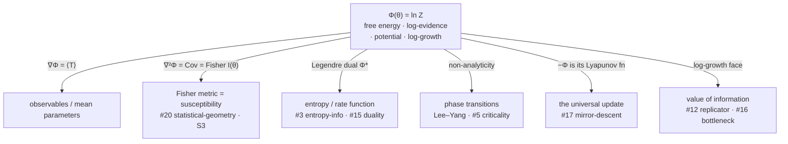

# The free-energy hub (log-partition function)

> **One-line claim:** A single scalar — Φ(θ) = ln Z(θ), the log-partition function
> — is the common center the map orbits: it *is* thermodynamic free energy,
> Bayesian log-evidence, the online-learning potential, the exponential-family
> log-normalizer, and population log-growth; its **gradient** gives observables, its
> **Hessian** gives the Fisher metric, its **Legendre dual** gives entropy, and its
> **singularities** are phase transitions.
> **Headline correspondence level:** **L3** for the exponential-family identities
> (exact), **L4** where Lee–Yang makes "transition = non-analyticity of Φ" a
> theorem; L2 where "free energy" is borrowed loosely.
> **Status:** developing — *consolidation* of #3, #5, #12, #15, #16, #17, #20

## Why this entry exists

Restraint on S1 ([derivation](../derivations/S1-universal-update.md)) showed the
normalizer Z was one object across four updates. This entry cashes that in: Z's
logarithm is the **hub** of the whole catalog. The claim is not analogy — the
orbiting entries are literally *derivatives, transforms, and limits of one convex
function*. Finding the center is a structural simplification of the map.

## Statement

For an exponential family p(x | θ) ∝ exp(θ·T(x)), define the log-partition function

```
   Φ(θ) = ln Z(θ) = ln ∫ exp(θ · T(x)) dx     (a convex function of θ)
```

Then, exactly:

```
   ∇Φ(θ)   = E[T(x)]              → mean parameters / observables
   ∇²Φ(θ)  = Cov[T(x)] = I(θ)     → Fisher information = susceptibility = fluctuations
   Φ*(μ)   = sup_θ (θ·μ − Φ)      → (neg)entropy / large-deviations rate function
   Φ non-analytic (N→∞)           → phase transition (Lee–Yang zeros pinch the axis)
```

## One object, many names

| Domain | Z is… | Φ = ln Z is… |
|--------|-------|--------------|
| Physics | partition function | −βF (F = free energy) |
| Bayes | marginal likelihood | **log-evidence** (−Φ = surprise / description length) |
| Online learning | Σ exp(−η·loss) | the **potential** whose drop bounds regret |
| Statistics | exp-family normalizer | the **cumulant generating function** |
| Evolution / betting | mean fitness per generation | **log-growth rate** (Kelly) |

## The hub diagram

Each derivative-facet of Φ is an existing catalog entry:



The Ising susceptibility that diverged in [S3](../experiments/S3-fisher-geometry/)
was *literally* χ = ∂²Φ/∂h² — the hub's Hessian. The experiment already measured
the hub going singular.

## Shared mechanism

Not convergence, **identity**: the orbiting quantities are ∇Φ, ∇²Φ, Φ*, and
lim-of-Φ of the *same* convex potential. That is mechanistic (L3). Where the
thermodynamic limit exists, "phase transition ⇔ non-analyticity of Φ" is a theorem
(Lee–Yang), lifting that facet to L4.

## Boundary conditions / where it breaks

- **Exact only where a partition function is well-defined** — exponential families,
  equilibrium systems, or a valid cumulant generating function. Non-equilibrium /
  heavy-tailed / non-normalizable systems lose the clean structure.
- **Variational free energy ≠ Φ, exactly.** The neuroscience/ML "free energy" (ELBO,
  Friston) is a *bound*, −ELBO ≥ −Φ, tight only at the true posterior. Genuine
  relative, honest L2/L3 — do not equate them silently.
- **Lee–Yang needs the large-N limit;** finite systems only round the singularity.

## Evidence / predictive transfers

- ∇²Φ = Fisher = susceptibility is the fluctuation–dissipation identity — response
  equals fluctuation because both are the hub's Hessian (see [S15](../questions/SPECULATIVE.md)).
- The S1 identity **free energy = −log evidence = cumulative log-loss = −log-growth**
  is the −Φ face read in four fields.

## Open questions

- [S13](../questions/SPECULATIVE.md): is *every* transition (incl. grokking, SAT) a
  non-analyticity of some Φ?
- Does promoting the hub let us *delete* redundancy from the catalog — are #3 and #16
  facets rather than independent invariants?

## References

- Jaynes 1957; Csiszár 1975 — MaxEnt, exponential families, I-projection.
- Wainwright & Jordan 2008 — log-partition, mean parameters, Fisher (∇²Φ = Cov).
- Lee & Yang 1952 — zeros of the partition function and phase transitions.
- Touchette 2009 — large deviations; Φ and its Legendre-dual rate function.
- Kelly 1956; Rivoire & Leibler 2011 — log-growth = information.
